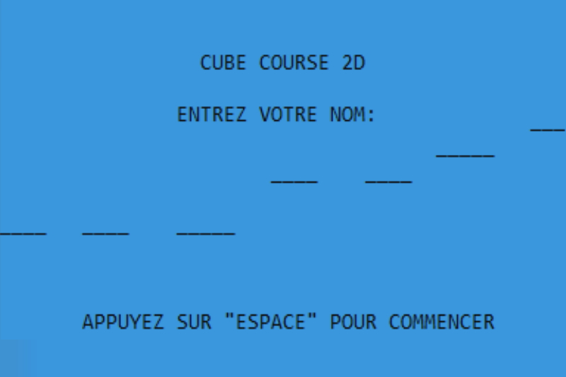
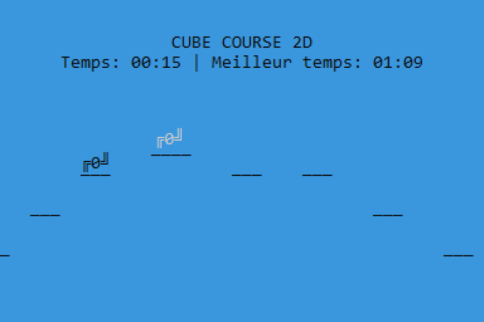
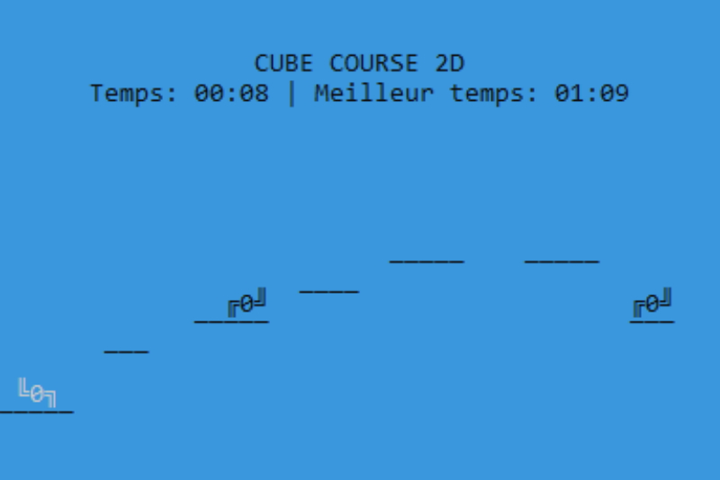
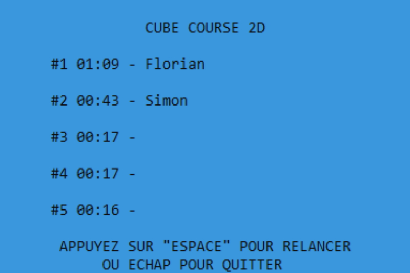

# 🎮 CubeCourse2D

## 🚀 Overview

CubeCourse2D is a fast-paced platformer where the player must survive as long as possible by jumping from platform to platform. But be careful—platforms are generated randomly, making each game unique and unpredictable!

## 🎯 Objective
- 🏃 **Survival**: Stay alive by jumping across platforms.
- ⚠️ **Random Challenges**: Platforms and enemies appear randomly, keeping you on your toes.
- 🏆 **Competition**: Test your reflexes and beat your high scores!

## 📝 Features
- 🎨 **Minimalist Design**: A simple yet effective aesthetic for full immersion.
- 🎲 **Random Generation**: No two levels are the same—every run is a new challenge!
- ⚔️ **Enemy Elimination**: Jump on enemies to defeat them, but be careful not to miss!
- 🎶 **Inspired by Geometry Dash**: A fast-paced and addictive gameplay experience.

### 📷 Screenshots

    
    
    

## 🌟 License
This project is open-source. Feel free to play, modify, and contribute! 🚀
